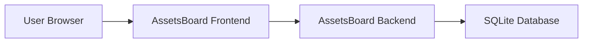

# Systems Blueprint for **AssetsBoard**

## Overview

AssetsBoard is a web application which allows private investors to manage their investment assets by adding new assets with category, value, quantity, and acquisition date; updating asset details; and viewing categorized investment summaries. The system is designed with a clear separation between the frontend and backend and utilizes a relational database for persistent storage.

## Frontend

### Tech Stack

- **Language**: TypeScript
- **Framework**: Other (Bun_Vanilla_TS)
- **Styling**: PicoCSS
- **State Management**: None
- **Routing**: None
- **API**: Fetch

### Architecture

- **Software Architecture**: Layered
- **Programming Paradigm**: Functional
- **Folder Structure**:
  ```
  - src/
    - app/ (pages and repositories)
    - models/ (data models)
    - utils/ (helpers and shared components)
  ```

### Presentation

- **Front runtime**: SPAs
- **Interactions**: Routes, Modals
- **Style**: Responsive, Dark_Mode
- **Colors**: Lime, Cyan
- **Fonts**: Tomorrow, Fira_Mono

## Backend

### Tech Stack

- **Language**: TypeScript
- **Framework**: Bun_Vanilla_TS

### Architecture

- **Software Architecture**: Layered
- **Programming Paradigm**: Functional
- **Folder Structure**:
  ```
  - src/
    - api/ (controllers and repositories)
    - models/ (data models)
    - utils/ (helpers)
  ```

### Authentication

- **Authentication**: JWT

## Database

- **Database Type**: Relational
- **Database**: SQLite
- **Naming Convention**: snake_case
- **Tables or Collections**: plural
- **PK Identifiers**: id
- **FK Indexes**: user_id
- **Auditing**: created_at, updated_at

## Diagram



_End of System Architecture Document for AssetsBoard_
